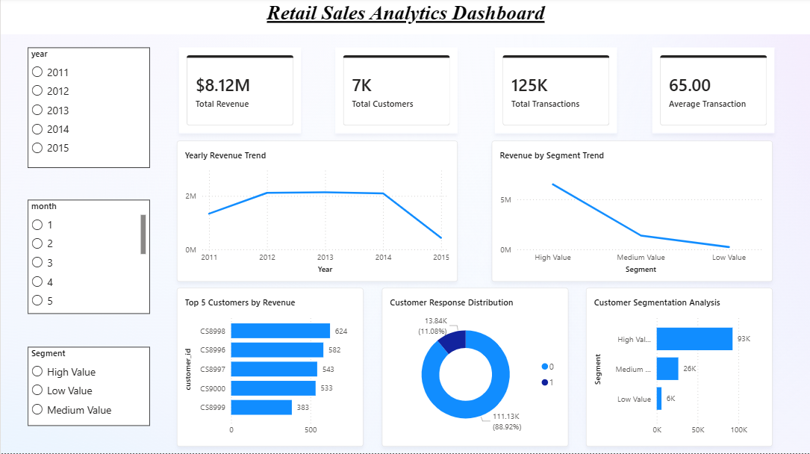

# Retail Sales Analytics Dashboard

## Project Overview

The Retail Sales Analytics Dashboard is an end-to-end Business Intelligence and Data Analytics project designed to analyze retail transaction data, customer purchasing behavior, and revenue trends.

The project combines Python, PostgreSQL, SQL, and Power BI to create a complete analytics pipeline from raw data processing to interactive dashboard visualization.

### The dashboard provides actionable business insights into:
- Revenue trends
- Customer segmentation
- Transaction analysis
- Customer response behavior
- Top-performing customers

---

## Project Architecture

```text
Raw CSV Data
     ↓
Python Data Cleaning & Feature Engineering
     ↓
PostgreSQL Database Integration
     ↓
SQL Analytics Queries
     ↓
Power BI Dashboard Visualization
```

---

## Technologies Used

| Technology | Purpose |
|---|---|
| Python | Data Cleaning & Analytics |
| Pandas | Data Manipulation |
| Matplotlib / Seaborn | Data Visualization |
| PostgreSQL | Database Storage |
| SQLAlchemy | Database Connection |
| SQL | Business Queries |
| Power BI | Dashboard & BI Reporting |

---

## Dataset Information

The project uses two retail datasets:

1. `Retail_Data_Transactions.csv`
2. `Retail_Data_Response.csv`

### The datasets contain:
- Customer IDs
- Transaction Dates
- Transaction Amounts
- Customer Response Status

---

## Key Features

### Data Cleaning & Preparation
- Removed missing values
- Converted data types
- Feature engineering for:
  - Month
  - Year
  - Day
  - Month-Year
- Outlier analysis using Z-Score

---

## Customer Analytics

### RFM-Based Customer Segmentation

Customers were segmented into:
- High Value Customers
- Medium Value Customers
- Low Value Customers

---

## SQL Database Integration

The cleaned dataset was loaded into PostgreSQL using SQLAlchemy and Psycopg2.

### Database Features
- PostgreSQL relational storage
- SQL query analysis
- Structured analytics workflow

---

## Dashboard KPIs

The Power BI dashboard includes:

- Total Revenue
- Total Customers
- Total Transactions
- Average Transaction Value

---

## Dashboard Visualizations

### Revenue Analysis
- Yearly Revenue Trend
- Monthly Sales Analysis

### Customer Analytics
- Top 5 Customers by Revenue
- Customer Segmentation Analysis
- Customer Response Distribution

### Interactive Filters
- Year Slicer
- Month Slicer
- Segment Slicer

---

## Project Structure

```text
Retail-Sales-Analytics/
│
├── dashboard/
├── data/
├── notebooks/
├── reports/
├── scripts/
├── sql/
├── README.md
├── requirements.txt
```

---

## Sample SQL Queries

### Total Revenue

```sql
SELECT SUM(tran_amount) AS total_revenue
FROM retail_sales;
```

### Top 5 Customers

```sql
SELECT
    customer_id,
    SUM(tran_amount) AS revenue
FROM retail_sales
GROUP BY customer_id
ORDER BY revenue DESC
LIMIT 5;
```

---

## Business Insights

- Revenue remained consistently strong between 2012 and 2014.
- High Value customers generated the majority of overall revenue.
- Customer response distribution showed a larger inactive customer base.
- Top customers contributed significantly to total sales.

---

## Dashboard Preview



---

## Future Enhancements

- Real-time dashboard integration
- Customer churn prediction
- Sales forecasting
- Live PostgreSQL-to-Power BI connection
- Advanced drill-through analytics

---

## Author

**Omshree Patra**

---

## License

This project is for educational and portfolio purposes.